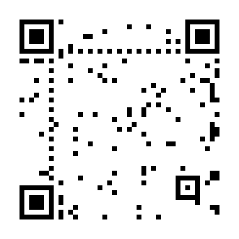

# black-white-qr

「黒」という文字列を表しながら、黒いモジュールをできるだけ少なくした QR コードを作る。



v6（41×41）、誤り訂正レベル L、マスク 6 で、黒は 1681 モジュール中 257 個（15.3%）になった。
gozxing と Android のスマートフォンで「黒」と読めることを確認している。

## 使い方

```sh
mise install
go run . -versions 6 黒
go test ./...
golangci-lint run
```

## 何が自由に選べるのか

QR コードの黒の量は、仕様に照らすとほぼ機械的に決まる。
ふつうの生成器で作ると、黒は 46〜50% ほどになる。
数十通りの文字列と誤り訂正レベル、バージョン、マスクを総当たりで取り替えても、最良で 45.8% にとどまった。

デコーダが読むのは、モード指示子、文字数、文字データ、終端子 `0000` までである。
それより後ろのデータビットは読まれない[^pad]。
そこで、終端子より後ろのビットを、その位置のマスクビットと同じ値にする。
マスクと XOR をとったあとの値が 0 になり、モジュールは白になる。
残る黒は次の 3 つである。

- **機能パターン**：ファインダー、タイミング、アライメント、フォーマット情報、バージョン情報。バージョンごとに固定で、v6 では 155 個（9.2%）になる。
- **ヘッダ**：「黒」をバイトモード（UTF-8）で表す 40 ビット（終端子を含む）。
- **誤り訂正符号語**：データから決まるので、素朴に作ると約半分が黒になる。

誤り訂正レベルは、誤り訂正符号語がいちばん少ない L を選ぶ。
マスクは 8 通りしかないので、すべて評価する。
パディングを白にするだけで、v6 の黒は 18.6% まで下がる（マスク 6 のとき）。

## 誤り訂正符号語の黒を減らす

誤り訂正符号語は、パディングの値を変えれば変わる。
Reed-Solomon 符号は GF(2) 上で線形なので、この問題はブロックごとに「パディングと誤り訂正符号語のうち、黒になるビットの数を最小にする」ことになる。
パディングを全部白にするのは解の一つにすぎず、パディングを少し黒にして、誤り訂正符号語の黒を大きく減らせることがある。

この問題はシンドローム復号（剰余類の最小重み元を探す問題）であり、一般には NP 困難である。
`search.go` では、情報集合（掃き出しで基底にとる列の組）を 1 列ずつ入れ替える局所探索で近似している。
黒が減る入れ替えがあればそれを選び、なければ黒の数を変えない入れ替えをランダムに行う。
20 万ステップで、v6 のデータ領域（誤り訂正ビット 288 個を含む）の黒は 158 個から 102 個に減った。

## バージョンの選び方

黒の比率だけを見ると、大きいバージョンほど有利になる。
v38 では 10.0% まで下がった。
ところが、v38 にはアライメントパターン（5×5 の四角）が 46 個あり、データがほとんど白になると、それが格子として目立つ。
逆に v1 はアライメントパターンを持たないが、3 隅のファインダーが面積の大半を占め、黒は 34% になる。

v6 は、アライメントパターンが 1 個でバージョン情報を持たない、最大のバージョンである。
v1、v6、v13、v38 を並べて見比べると、中央が最も白く見えたのは v6 だった。

## 注意

- 仕様上、パディング符号語は `0xEC` と `0x11` の繰り返しと決められている。この QR コードはそこを守っていない。読み取れるかどうかはデコーダの実装に依存する。
- 漢字モード（Shift_JIS）で符号化すると、Android のスマートフォンでは文字化けした。ビット数は少なくて済むが、バイトモードの UTF-8 を使う。

[^pad]: 終端子のあとはパディングビットとパディング符号語が続く。少なくとも zxing-cpp と gozxing は、その値を検査しない。
